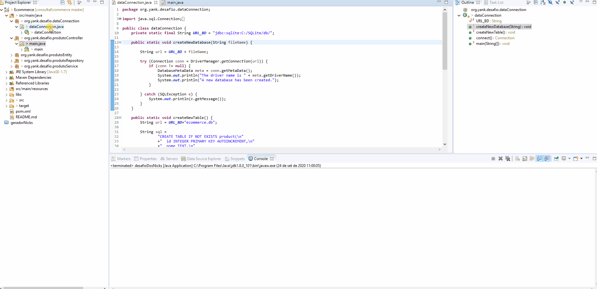

# Desafio do Ecommerce

Projeto desenvolvido para consumir a sessão de 'Celulares e Smartphones' do e-commerce Americanas.

# Tecnologias utilizadas

- JSOUP
- SQLite

# Instalação

$ git clone https://github.com/nathaliagiul/consultaEcommerce.git

# Configuração

Necessário ajustar a url na classe dataConnection.java conforme a sua instalação do SQLite.

# Execução

Para a execução do projeto é necessário a utilização da IDE Eclipse e do Java.

Após o clone do projeto, importar o projeto Maven no eclipse, clicar na classe main dentro do package org.yank.desafio.produtoController e executar através do run as Java Application.

Aguardar alguns instantes para que seja realizada as inserções dos produtos, e as consultas sugeridas tal como: Produto com maior desconto, Produto mais avaliado, Produto mais barato.

OBS.: Utilizado o regex para formatação das strings e tratamento na coleta dos dados. Porém, foram identificados padrões de titulação dos produtos apenas em alguns objetos.  

# DEMO
